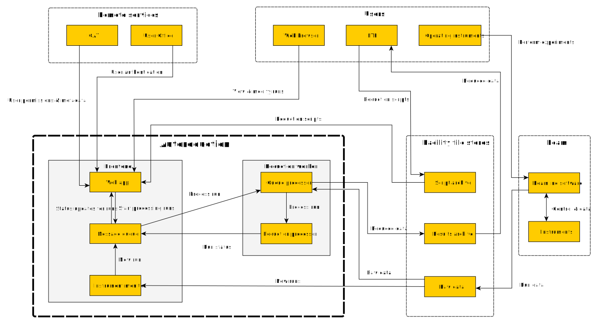

# Background

## Usage

This system was originally designed for use at the Spallation Neutron Source at Oak Ridge National Laboratory, then subsequently at the ISIS neutron source of the Science and Technology Facilities Council. These facilities operate pulsed neutron sources for scientific and industrial research, with many independent instruments receiving neutrons from a source for use in experiments.

In both cases autoreduction was intended to serve as part of an automation system to handle data produced by these neutron beam instruments. However, the process is applicable to beamline instruments in general, such as might be used on muon or X-ray beams.

## Data reduction

The autoreduction service exists to reduce beamline instrument data. An instrument produces discrete tranches of data, referred to as 'runs', in service of experiments. This raw data typically needs to be processed – 'reduced' – before it can be used by scientists, by running a script on it. Although the script itself need not change often, it may have configurable parameters – variables – which ought to be changed frequently.

The autoreduction system is intended to automate this process. Instrument scientists provide it with reduction scripts - in a specified location on a shared file archive - and sets of variables to use to reduce runs. The system watches for the completion of runs, and runs the appropriate script, with the correct variables, on them, supplying the reduced data to an archive for users to retrieve.

## Requirements

The system is intended primarily to serve the instrument scientists – who manage beamline instruments – and users who use the instruments to run experiments. The key requirements for these users were to

1. Automate the reduction of data from beam instruments, using scripts provided by instrument scientists.
2. Show the status of reduction on runs, as well as the results and locations of reduced data, to users.
3. Allow instrument scientists to set the parameters used for reduction, in advance and retroactively.
4. Allow users and instrument scientists to see what script, with which parameters, was used to reduce a run.
5. Allow users and instrument scientists to modify the parameters used for a run, and re-run reduction using new parameters or scripts.

Additional constraints were to

1. Limit access to the system to ensure that only staff and scientists can access runs and instruments.
2. Utilise existing authentication systems to validate identities and permissions for (1).
3. Allow scalability for processing large amounts of data in a timely manner.
4. Integrate with ICAT – the scientific metadata catalogue in use at ISIS.

# System architecture

The architecture is based on a queue node, which co-ordinates communication between all components of the system. This maintains separate message queues, which allow components to act on messages from other components and update the system. These components are

1. A listener for new jobs
2. The state database & coordinator
3. Workers for reduction processing

When the listener detects that a new job should be created, it sends a request to do so to _Data Ready_. The state database consumes the request and creates the corresponding job in the database, before sending a request to process it to _Reduction Pending_. A reduction worker takes this message and runs the appropriate script, sending the result to either _Reduction Complete_ or _Reduction Error_, where it's consumed by the state database to update the status of the run.

## Message queue

Apache ActiveMQ is used as the message queueing system, with message contents as JSON-formatted objects. The intention of the message is conveyed by which queue it's placed in, rather than a field in the message itself. Runs can be 'scheduled' simply by using ActiveMQ's scheduled delay feature, which allows a message to be delivered a given time after it's been pushed to the queue.

Messages contain metadata for the run such as a (unique) run number and version, the experiment and instrument that the data is associated with, and any logs or errors resulting from reduction. They also carry the necessary information to carry out the data reduction - the Python script to run on the data, paths to the data, and variables to be used by the script.

Data files typically run in the hundreds of MB at least, so would be impractical to send directly in a message; they're provided as file paths on a shared file archive. Meanwhile, the reduction script to be used is sent as a string; the script is served from the state database, and using the message queue directly to send it obviates the need to rely on a potentially flaky shared file store within the system.

## Job listener

When a new run has been completed on the beam line, the data files are placed in a shared filesystem. A node runs a Python watchdog daemon that tracks changes in this filesystem, and when a new run is added, sends a message to _Data Ready_ with details of the run. This particular choice of listener isn't crucial; anything would work as long as it pushed the same message to the queue. In the current production system at ISIS, this is the same node as the state database itself.

## State database

A node keeps track of the status of runs in a local SQL database. This server hosts a Python service responsible for listening on _Data Ready_, to create new runs and then dispatch them to _Reduction Pending_. It manages variables for reduction, and selects the correct set for the run. The same server is responsible for serving the Python/Django web app. The database is therefore accessed through Django's object interface, and reduction runs, etc., are tracked as Django objects.

The daemon receives status updates from reduction workers on _Reduction Started_, _Reduction Complete_ and _Reduction Error_, making the appropriate changes to the database. On some messages in the error queue, the daemon will create and schedule the appropriate retry runs. A system for emailing notifications of run failures to administrators is also implemented here.

## Reduction worker

The data reduction itself is performed by a worker node, running a Python daemon listening on _Reduction Pending_. When the worker consumes a message, it will spawn a process starting the job and notifying _Reduction Started_. This process tests for access to the filesystems used for storing the raw and reduced data, triggering a scheduled retry later – on _Reduction Error_ – if they're unavailable. Otherwise, it will proceed with the reduction, loading and then running the provided script.

On a successful run, the job will notify _Reduction Completed_ with the location of the reduced data; otherwise, it will send the reason for failure to _Reduction Error_, most likely without triggering a retry. In both cases it will send logs of the process, and clean up after itself. Some runs associated with the same experiment would write output to the same directory; to prevent clashes due to this, the node contains an internal queue holding all runs associated with an experiment for as long as it's actively reducing another run for the same experiment.

# Interface

## Reduction scripts

The wholly automated portion of the system revolves around running scientist-provided scripts to reduce raw instrument data. These scripts are provided as Python scripts on a per-instrument basis, typically using the Mantid software package to do the heavy lifting. They're stored on a shared file store in a known location, where they can be modified at will by instrument scientists; runs store the script they were reduced by in the system database, but new runs will be reduced using the current script on the file store.

Aside from overall logic, these scripts typically require parameters such as calibration files, information about how the instrument was run, output settings, and so on. While some users prefer to hard-code these in their scripts, others would rather make use of a system for managing these variables separate from the script itself. A list of variables and default values is provided in a Python file similar to the reduction script, but the autoreduction system keeps track of variable configurations provided to it through the web app, and applies them to the relevant runs.

The reduction scripts need to integrate with the automation system, and as such must conform to a certain specification: the script must have a _main()_ method, taking an input file and an output directory as arguments. If the script uses system-supplied variables, it must have a certain _import_ directive, which serves as a point of injection for the variables when it is run.

Mantid provides a wrapper for data reduction through its Python interface, and for many instruments the whole reduction processing is also included. Writing reduction scripts for those instruments is essentially trivial, boiling down to some boilerplate with very little difference between instruments.

## Web app

The web app provides the user-facing interface for managing reduction. It was developed in Python, using the Django web framework, and is tightly integrated with the state database.

Users log in via the ISIS User Office – using their federated credentials – and their level of access is then governed by ICAT's information on the experiments and instruments they should be able to see. A searchable index of runs is displayed on the front page, sorted by instrument, experiment and run number, showing their reduction status. Runs, experiments and instruments displayed here have links to their summary pages.

Each run has its own summary page with detailed information; a user can see the status of the reduction, where the reduced data is, and the script and variables that were used to reduce it. From here the run can be re-run, with or without modifying the variables used. Any experimenter can access this page for their runs, and it's intended that external scientists running experiments be able to control their data reduction directly in this way.

Experiments also have summary pages, showing all the runs that are associated with a given experiment along with their status and data locations. Metadata about the experiment is retrieved from ICAT and displayed here.

Instrument scientists can access a summary page for their instruments, showing the current status of runs on an instrument, as well as current and upcoming run variables. From here instrument scientists can assign sets of variables by experiment and run number, which will then be used automatically as appropriate for new runs. Batch re-running of past jobs is also possible here. This is intended to be the main point of access for instrument scientists to control data reduction.

Administrators can access everything above, and additionally have access to pages displaying all queued and failed jobs. These pages provide an overview of the status of the system at a glance, and have controls for batch operations on failed jobs such as to re-run them.

# Current status

The system is deployed at ISIS, in limited use. The frontend node, serving the message queue as well as managing the state and web app, is a Windows Server system running on a Hyper-V cluster; it serves the web app using Microsoft's Internet Information Services (IIS) and FastCGI. There is one reduction node, running Red Hat Enterprise Linux on a dedicated Dell PowerEdge R820 server – reducing large amounts of data is very CPU-intensive.

It is planned that the autoreduction system be developed to further meet the needs and tastes of potential users at ISIS and other particle facilities, and enter a more prominent role in automating data processing there. Future development to this end may involve

1. Expanding the system to accommodate greater volume of use – this might involve adding more reduction workers, for example.
2. Integrating other methods of listening for new runs – the current method of watching a file archive is specific to ISIS.
3. Improving portability and deployability of the current software; the state database/webapp in particular is currently unsupported for Linux, and the whole system is somewhat nontrivial to deploy even to a development environment.