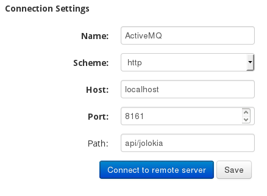

# Autoreduction setup at ISIS

## Red Hat 7 - automated installation

The install script will prompt for an ActiveMQ keystore password at the start of the installation, but otherwise will run by itself.

    sudo -i
    cd ~
    git clone https://github.com/mantidproject/autoreduce.git
    ./autoreduce/ISISPostProcessRPM/setup.sh
    
After it has run, 

1. ActiveMQ credentials should be changed in `/opt/activemq/conf/activemq.xml` - in the `<authenticationUser>` tag - and in `/etc/autoreduce/post_process_consumer.conf`.

2. ActiveMQ can be started by running `/opt/activemq/bin/activemq start` and the monitor by `python /usr/bin/statusMonitor_daemon.py start`. These expect to run as root.

3. The queue processor can be started by `python /usr/bin/queueProcessor_daemon.py start`; by default the setup expects this to be run as the user `ISISautoreduce@fed.cclrc.ac.uk`.

4. The setup can be tested by

        cd ~/autoreduce/ISISPostProcessRPM/rpmbuild/autoreduce-mq/test
        nano testconfig.py # Enter the correct address and credentials for ActiveMQ
        python stompActiveMQtest.py
        python sendMessage.py

    The first test should exit after printing `received a message`, and the second should put a message into ActiveMQ's queue.


## Red Hat 7 - manual (old)

First install Mantid using: http://download.mantidproject.org/redhat.html

### ActiveMQ

1.  Downloaded apache-activemq-5.11.1-bin.tar.gz and unpack (https://activemq.apache.org/activemq-5111-release.html)
    
        wget http://archive.apache.org/dist/activemq/5.11.1/apache-activemq-5.11.1-bin.tar.gz
        tar -zxvf apache-activemq-5.11.1-bin.tar.gz
        sudo mv apache-activemq-5.11.1 /opt/
        sudo ln -sf /opt/apache-activemq-5.11.1/ /opt/activemq
     

2. To configure ActiveMQ to communicate with stomp + SSL,

        sudo nano /opt/activemq/conf/activemq.xml
        
   Modify the stomp transportConnector tag to be: 
    
        <transportConnector name="stomp+ssl" uri="stomp+ssl://0.0.0.0:61613?transport.enabledProtocols=TLSv1,TLSv1.1,TLSv1.2&amp;maximumConnections=1000&amp;wireFormat.maxFrameSize=104857600"/>
        
    or add it in the `<transportConnectors>` section if no stomp line exists already.
        
    Add the following directly below the `<broker>` tag (making sure to change cert names and passwords):
        
        <sslContext>
                <sslContext keyStore="broker.ks" keyStorePassword="changeit"
                trustStore="client.ts" trustStorePassword="changeit"/>
        </sslContext>
        
    Create/renew SSL certificates - keystore and truststore (http://activemq.apache.org/how-do-i-use-ssl.html)
    
        cd /opt/activemq/conf
        sudo rm -f broker.ks broker.ts client.ks client.ts
        keytool -genkey -alias broker -keyalg RSA -keystore broker.ks -validity 2160
        keytool -export -alias broker -keystore broker.ks -file broker_cert
        keytool -genkey -alias client -keyalg RSA -keystore client.ks -validity 2160
        keytool -import -alias broker -keystore client.ts -file broker_cert
        keytool -export -alias client -keystore client.ks -file client_cert -validity 2160
        keytool -import -alias client -keystore broker.ts -file client_cert

   Note that ActiveMQ may sometimes default to using a different configuration file than this; `rm -rf /opt/activemq/examples` to remove a potential conflict.
    
        
3. ActiveMQ can also optionally be configured to communicate without SSL: 

        sudo nano /opt/activemq/conf/activemq.xml
        
   Modify the stomp transportConnector tag to be: 
    
        <transportConnector name="stomp" uri="stomp://0.0.0.0:61613?maximumConnections=1000&amp;wireFormat.maxFrameSize=104857600"/> 
        
    or add it in the <transportConnectors> section if no stomp line exists already. But autoreduce relies on SSL connections; see below to fix this.
        
        
4. Username and password for submiting jobs by adding to the `<broker>` section directly below the `<sslContext>...</sslContext>` entry, or directly below the `<broker>` tag if there's no such entry (with XXXXXXXXXX substitued by suitable password):

        <plugins>
            <simpleAuthenticationPlugin>
                <users>
                    <authenticationUser username="autoreduce" password="XXXXXXXXXX" groups="users,admins"/>
                </users>
            </simpleAuthenticationPlugin>
        </plugins>
        
5. The queue scheduler should be enabled with the `schedulerSupport="true"` directive in the broker, e.g., change

        <broker xmlns="http://activemq.apache.org/schema/core" brokerName="localhost" dataDirectory="${activemq.data}">
    
    to

        <broker xmlns="http://activemq.apache.org/schema/core" brokerName="localhost" dataDirectory="${activemq.data}" schedulerSupport="true">


Start ActiveMQ as root: `sudo /opt/activemq/bin/activemq start`

To stop, type: `sudo /opt/activemq/bin/activemq stop`

To check that ActiveMQ is running e.g. type 

* `netstat –tulpn` and check if port **61613** is listed. 
* or `ps ax | grep activemq` and look for java entry running activemq.jar 
* or check if http://localhost:8161/admin/index.jsp is running. Note the factory username/password is admin/admin. 

ActiveMQ logs can by default be found in `/activemq-install-dir/data`. By default the log level is INFO, this can be
changed in `/activemq-install-dir/log4j.properties`.

### Hawtio (optional)
[Hawtio](http://hawt.io/) is a free modular web console which can be linked up to your ActiveMQ server. It provides a cleaner and more user-friendly interface for managing your ActiveMQ queues. Nevertheless, this is an optional step as the in-built Apache queue manager is serviceable though not as clean. If you do want to install Hawtio, follow the steps below:

1. Download the jar [here](https://oss.sonatype.org/content/repositories/public/io/hawt/hawtio-app/1.4.67/hawtio-app-1.4.67.jar) and place it on the machine which is running your ActiveMQ server in a suitable location
2. Once the JAR is in a place that you're happy with on the ActiveMQ server, change into that directory and run:
* ````java -jar hawtio-app-1.4.67.jar```` to run Hawtio on the default port (8080)
* ````java -jar hawtio-app-1.4.67.jar --port 8080```` to specify the port to run Hawtio on.
3. Hawtio will then run through and the Hawtio application will be available at: http://localhost:8080/hawtio/
4. Once you hav navigated to the Hawtio address, you will be presented with a connections page where you can alter connection settings before connecting. If you use the settings below and then click on the 'connect to remote server' button, you will be shown the Hawtio queue interface to interact with your ActiveMQ server.
 

### Setting up a worker on linux (redhat) 

1. Clone the autoreduce repository from the home directory

        cd ~
        git clone https://github.com/mantidproject/autoreduce.git
        cd autoreduce

2.  Install the libraries located under `SNSPostProcessRPM/rpmbuild/libs`. 

        sudo rpm -i SNSPostProcessRPM/rpmbuild/libs/* 

3.  Create and install the RPM

        cd ISISPostProcessRPM/rpmbuild/
        sudo ./make-autoreduce-rpm.sh
        sudo rpm -i ~/rpmbuild/RPMS/x86_64/autoreduce-mq-1.3-16.x86_64.rpm

4.  Modify the address "brokers" in `/etc/autoreduce/post_process_consumer.conf` to point to ActiveMQ address and username and password for submitting jobs to ActiveMQ - the credentials set above in the `<simpleAuthenticationPlugin>` section.
  
5.  Specify the location where the script and reduced data get stored by modifying `reduction_directory`, `archive_directory` and `ceph_directory` in the same file (`/etc/autoreduce/post_process_consumer.conf`).

6. At present create `/autoreducetmp` folder - `mkdir /autoreduce`. It's possble to change owner and group to user that will be used to run queueProcessor (to store temporary created reduction files) using chmod.

7. Install the dependendencies required by the package:
    
        yum install python-pip
        pip install stomp.py daemon twisted service_identity

8.  To start this as a daemon type `python /usr/bin/queueProcessor_daemon.py start` as the user you want to use to run queueProcessor (for some default directories, it may need to be `sudo python /usr/bin/queueProcessor_daemon.py start`).

To modify the software to use plaintext (non-SSL) connections, the Python scripts (`/usr/bin/queueProcessor.py`, `/usr/bin/PostProcessAdmin.py`, `sendMessage.py`) require a slight modification, changing `use_ssl=True, ssl_version=3)` to `use_ssl=False)` in lines of the form `stomp.Connection( ...`

Logging associated with the Logger used in the python worker script gets stored in `/var/log/autoreduction.log`. To modify logging setting edit `/usr/bin/autoreduction_logging_setup.py`.  

To check rpm and uninstall do `rpm -qa | grep autoreduce` and `rpm -evv name-of-rpm-package`.

### Testing the setup

1. In `~/autoreduce/ISISPostProcessRPM/rpmbuild/autoreduce-mq/test/sendMessage.py`, point `reduction_script_dir` to the directory containing `reduce.py` (the same directory is fine)

2. In the same file, point `testdata` to an accessible nxs file, the path of which contains somewhere a folder of the form cycle_xx_x, where x is a digit. The script is set up to take GEM data, and points to a valid network location for one such file.

3. With ActiveMQ and queueProcessor_daemon running, run `sudo python sendMessage.py`. The ActiveMQ control panel should show a message going into the ReductionPending queue, then ReductionStarted, then ReductionComplete.
