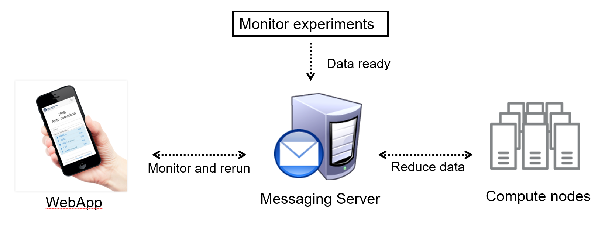

| Master        | Develop       |
| :-------------|:--------------|
|   |   |

# Autoreduction
The software and setup for a service designed to automatically reduce instrument data. Used at [ISIS Neutron and Muon Facility](https://www.isis.stfc.ac.uk). For further documentation see also [Wiki](https://github.com/ISISScientificComputing/autoreduce/wiki). 

In one (not complete) picture the Autoreduction service is:

The code for monitors of experiments, i.e. that send messages to the Messenging server when experiments are ready to be reduced (processed) is in monitors folder. The code for processors which consume/subscribe to Messenging queues and run jobs on the compute nodes are in the QueueProcessors folder. Finally, the code for the WebApp, which is used to monitor the system by both users and those who support the service is located in the WebApp folder. 

In one sentence, this service automatically takes raw data, reduce these (meaning process them in some way) while allowing the user and support staff to monitor the system and rerun jobs manually as needed (there is also a component which attempts to automatically rerun some types of failed job). 
