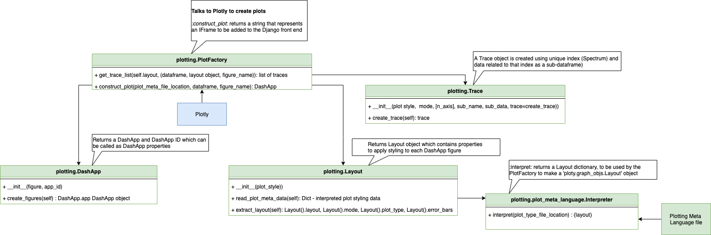

# Plot Factory

This directory contains the plot factory, responsible for constructing plot traces and figures to 
return a DashApp for direct insertion into a web-page.

### Trace
A collection of data and the specifications of which we want that data plotted. 
A trace will also be an object itself, and these will be named according 
to how you want the data displayed on the plotting surface.

For our use case, we can imagine a trace as a subset of a dataframe which stores many spectrum,
containing all data for one unique spectrum only. 

For a dataframe containing many spectrum, there will be N traces matching the number 
of unique spectrum.

### Figure
A figure is a nested dictionary containing a list sub-dictionaries which store individual traces and 
a sub dictionary containing information about that figures layout.

A figure contains the information needed to construct one graph to be placed in a DashApp.

A DashApp can contain many figures. 

Below is an example of what a figure containing 2 traces would look like:

``` python
self.figure = 
    {'data':
        [Scattergl({
        'error_y': {
            'array': [90.6091, 82.6862],
            'type': 'data',
            'visible': True},
        'mode': 'lines',
        'name': 'Instrument_Run_Number',
        'x': [100.25, 100.75],
        'y': [8210, 6837]
    }),
[Scattergl({
        'error_y': {
            'array': [90.6091, 82.6862],
            'type': 'data',
            'visible': True},
        'mode': 'lines',
        'name': 'Instrument_Run_Number',
        'x': [100.50, 100.90],
        'y': [8210, 6837]
    })],
    'layout': {
        'xaxis': {
            'type': 'log',
            'title': 'x_axis',
            'unit': 'unit'},
        'yaxis': {
            'type': 'log',
            'title': 'y_axis',
            'unit': 'unit'}}}
```

### DashApp
Dash apps are rendered in the web browser. You can deploy your apps to servers and then share 
them through URLs. Since Dash apps are viewed in the web browser, Dash is inherently 
cross-platform and mobile ready.

Our Implementation of DashApps will use a framework called 
[django-plotly-dash](https://pypi.org/project/django-plotly-dash/) which allows for 
direct insertion of DashApps into a Django webapp instead of hosting DashApps separately and 
pulling into Autoreductions webapp through an iframe.

## Usage
The plot factory should be called using the create_plot method from within the PlotFactory class 
taking the following arguments:
* plot_meta_file_location
* dataframe to containing N spectrum
* figure name - String containing the instrument name and run number (instrument_run-number)

for example: 
``` python
dashapp = plot_factory.PlotFactory(
            plot_meta_file_location=plot_meta_file_location,
            data=dataframe,
            figure_name="Instrument_Run_Number")
``` 

The dashapp will have the following properties:
* app_id - Unique DashApp ID to be used to track creation and deletion of DashApp instances
* app - DashApp object for insertion into webapp or to be hosted separately from webapp.

To view a DashApp object locally, you can create a short script similar the example below :
``` python
from plotting.plot_factory.plot_factory import PlotFactory  # Returns DashApp
from plotting.prepare_data import PrepareData  # Read CSV to generate dataframe

class DjangoDashApp:
    """Returns a Dash"""
    def __init__(self, data_location, meta_location, dashapp_name):
        self.data_location = data_location  # From repository root
        self.meta_location = meta_location  # From repository root
        self.dashapp_name = dashapp_name
        self.dashapp = self.get_dashapp()

    def get_dashapp(self):
        """Get DashApp from Plot Factory"""
        return PlotFactory().create_plot(
            plot_meta_file_location=f"../../{self.meta_location}",
            data=PrepareData().prepare_data(f"../../{self.data_location}"),
            figure_name=self.dashapp_name)

# .dashapp isn't required for this to serve a dashapp, but included for specificity
dashapp = DjangoDashApp(
'path/from/repository/to/file.csv',  # csv
'path/from/repository/to/file.yaml', # yaml
"Instrument_Run_Number").dashapp     # DashApp ID (used to call app in run_summary.html)
```
-Note that to view this, two templates will need to be added to django template such as 
run_summary.html the template tags whihc need to be added are:

```djangotemplate
 



```

The plot factory can only insert one figure (one dataframe) into one DashApp.

The plot factory has been designed to allow for the future use case of having many figures 
(dataframes) differing in design to be used in one DashApp.

Available plot styles which can be used:
* scattergl
* ~~bar~~

mode (additional data for a given plot):
* lines
* markers
* markers+lines

(Please note that not all mode settings work for all plot types. 
You should refer to [plotly's documentation]: https://plotly.com/r/reference/#scatter-mode)

Currently only scatter plot types are functional (Scatter, Scattergl) with all scatter plot modes.

Other plot types starting with the Bar plot will be supported in the future.

By default, if no value is associated to plot or mode keys in .yaml config file, a scatter 
line plot will be used.

Below is a UML class diagram segment to visually display the structure of the plot factory:


